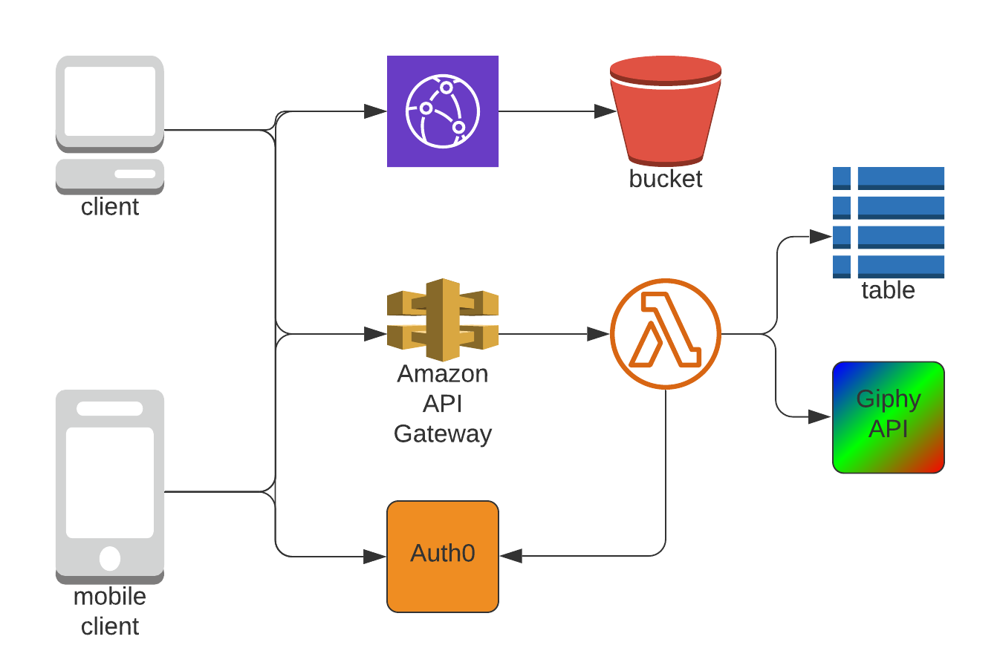
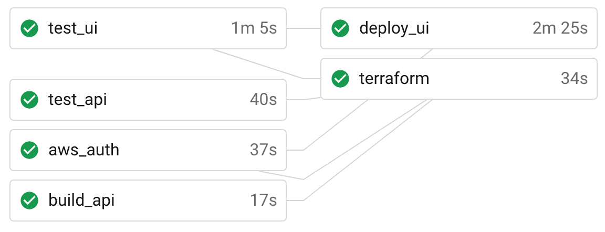

# HEGiphy

Search the Giphy image database, and save and categorize your favorite images!

See the live application at https://hegiphy.budjb.com!

This documentation discusses the architecuture and configuration of the application and
how to run it locally for development.

# High-Level Architecture



This application is organized as a SPA (Single Page Application) built with React and an
API built with Flask/Python.

## UI

The React UI compiles to a set of static assets (e.g. Javascript, CSS, images, etc) which are
uploaded to an AWS S3 bucket, which has been configured for web hosting. Those assets
are served to the general internet through a CloudFront CDN distribution via HTTPS.

## API

The API is a flask application built with Python. A set of RESTful endpoints are exposed by
the application to serve as a proxy to several Giphy endpoints, to allow storing favorite
images for a logged in user, and allow tagging of images marked as favorites. The application
deployed as a Lambda to AWS behind an API Gateway, and utilizes an AWS/WSGI middleware to
translate to/from API Gateway payloads.

Favorites and tag data is stored in an AWS DynamoDB table.

## Auth0

The Auth0 service is used for end-user authentication. Clients communicate directly with Auth0's
web services during the authentication process, and the API backend communicates with Auth0's
API to validate end-user authentication tokens (which themselves were provided by Auth0).

## CI/CD and Release Pipeline



Terraform and CircleCI are used to validate and release the application.

The process to submit code to and release the application follows the typical Git flow. Features
are developed in a feature branch on the main repository, and pull requests are created against
the master branch of the source code repository. Feature branches start a validation flow with
CircleCI, where tests are run and code format validation is conducted. Once these checks pass,
the pull request may be merged into the master branch.

Once code is submitted to the master branch, the same checks as above are run, and the release
process starts once those checks pass again. Most of the heavy lifting of deployment happens with
Terraform, which describes the infrastructure required to run the application. This also uploads
the compiled API to AWS Lambda. The UI assets are uploaded to S3 separately via an AWS console commad.

# Prerequisites

To run the applications contained in this service, the following prerequisites are required.

### AWS

The application is written to run on AWS and utilizes AWS services. To run the application,
an AWS account is required.

#### CircleCI IAM Role

An IAM role is required for CircleCI to be able to successfully deploy the infrasturcture for
the service via Terraform. The current configuration stores the programmatic access keys as
environment variables in a CircleCI context, and those environment variables are provided to
and are referenced by the configuration file.

The names of the environment variable keys required for CircleCI are:

- `AWS_ACCESS_KEY_ID`,
- `AWS_SECRET_ACCESS_KEY`
- `AWS_REGION`

#### S3 Buckets

Two S3 buckets are required: one to contain the shared Terraform state, and one to store the UI
assets. The naming of these buckets are not important, but the CircleCI and Terraform files must
be updated with these names. While technically possible, one bucket should not be used for both
purposes.

In the CircleCI config file (`.circleci/config.yml`), references to the `s3sync` and `terraform`
commands should be updated so that the correct bucket names are provided as parameters. The `s3sync`
command takes the name of the S3 bucket that will host UI assets, while the `terraform` command
takes the name of the S3 bucket that will contain Terraform state.

#### KMS

A new KMS key must be created for the storage of secrets using Mozilla SOPS. The ARN of the new
key must be used in the SOPS configuration file (`.sops.yaml`) and in the appropriate sections
of the Terraform files (see `main.tf`).

#### Route53

Terraform creates DNS entries for the service. The Terraform files must be updated with the AWS-
hosted zone and the names of the DNS records must be updated to match the zone they're hosted under.

### SOPS

Mozilla SOPS is used to version-control secrets within the source code repostory. The configuration
of this application causes SOPS to use a KMS key to encrypt configuration data (stored as JSON in
the `secrets.tfvars.json` file).

During deployment, CircleCI will decrypt the file with SOPS (and the configured KMS key) and provided
the values contained within to Terraform as Terraform variables.

Currently, the only value that must be present is the `giphy_api_key` entry, which should contain the
API key provided by Giphy to be used by the API service.

SOPS may be downloaded from the project page at https://github.com/mozilla/sops.

### Auth0

This service uses Auth0 as the authentication provider backend. An account must be created
along with an Application and an API.

When signing up, a new tenant will be created. The name of the tenant will also be used
as the Oauth2 issuer endpoint (also called `domain`).

As an example, if the tenant that was created was named `budjb-hegiphy`, the issuer URL
will likely be `https://budjb-hegiphy.auth0.com/`. The trailing slash is important.

#### Connections

The Connections determine what type of logins will be available to end users. Local sign-ups
are possible using the `Database` connection type. Social sign-in options (such as Google,
Facebook, etc) are also available. The connections to use are not important to the functionality
of the HEGiphy service, and may be chosen at your discretion. At least one connection must be
configured.

Please note that by default, social connections use Auth0's connection credentials. For proper
functionality of the application, any social connections that are configured should use your own
connection credentials. For example, if Google login will be used, you will need to configure
an application in the Google developer site and use the generated credentials in the Auth0
connection configuration.

#### Auth0 Application Configuration

In the Auth0 dashboard, create a new Application. The following settings must be used:

* The type of the application must be `Single Page Application`.
* The name may be anything of your choosing.
* The `Allowed Callback URLs`, `Allowed Logout URLs`, and `Allowed Web Origins` settings
  must be set to whatever URL that will be used to access the HEGiphy UI (if running locally,
  this is likely `https://localhost:3000`).

All other settings may be left with their default values. The `Client ID` that is generated for
the Application will be used by the HEGiphy UI application.

Once the Application is created, use the Connections tab to select any previously configured
Connections with the Application.

#### Auth0 API Configuration

In the Auth0 dashboard, create a new API. The following settings must be used:

* The name may be anything of your choosing.
* Choose an arbitrary `Identifier`. This may not be changed after the API is created.
  This string will be used as the JWT audience token. Note that this string will be needed
  to configure the HEGiphy API application.
  
All other settings may be left with their default values.

#### Configuring the Applications

The UI must be updated with the following values in the `config.js` file:

- `domain` and `clientId` from the Auth0 `Application`.
- `identifier` from the Auth0 `API` (as `audience` in the config file).

The API must be updated with the following values in the `config.py` file:

- `domain` from the Auth0 `Application` (as `auth0_domain` in the config file).


### Giphy

A developer account with Giphy is required in order to use their API service. An account
may be created at `https://developers.giphy.com/`. Be sure to create an app and take note
of the Giphy API key, which will be needed to configure the HEGiphy API application.

## Running the API Application Locally

### Configure

At a minimum, an AWS account with the following configured is required:

- A DynamoDB table.
- An SSM entry for the `giphy_api_key` value.

The AWS CLI must be installed and the AWS account must be configured in the shell that will
run the API application.

The API application must be configured for the specifics of the deployment environment. In particular,
see the `config.py` file and update the following snippet accordingly:

```python
_STATIC_CONFIG = {
    "auth0_domain": os.environ.get("AUTH0_DOMAIN", "TODO: replace with value provided by Auth0"),
    "dynamodb_table": os.environ.get("DYNAMODB_TABLE", "TODO: replace with your DynamoDB table name"),
    "giphy_base_url": os.environ.get("GIPHY_BASE_URL", "https://api.giphy.com/v1"),
    "giphy_api_key": os.environ.get("GIPHY_API_KEY")
}
```

### Starting

To start the API application, start a shell, configure the AWS account in the shell, and navigate to the
`hegipy-api` directory. Then, run:

```bash
./start.sh
```

The application should start without errors and you should see log lines stating:

> * Serving Flask app "app" (lazy loading)
> * Environment: production
>   WARNING: This is a development server. Do not use it in a production deployment.
>   Use a production WSGI server instead.
> * Debug mode: on
> * Running on http://127.0.0.1:8000/ (Press CTRL+C to quit)
> * Restarting with stat
> * Debugger is active!
> * Debugger PIN: 896-388-529

## Running the UI Application Locally

Note that you will need to have NodeJS v12.14 or a version compatible with it, along with
yarn installed.

Update the following snippet in the `config.js` file:

```javascript
const staticConfig = {
  domain: 'TODO: replace with the value provided by Auth0',
  clientId: 'TODO: replace with the value provided by Auth0',
  audience: 'TODO: replace with the value provided by Auth0'
};
```

To start the application, start a shell and navigate to the `hegipy-ui` directory. Then, run:

```bash
yarn install
yarn start
```

When successful, the output should resemble the following:

> Compiled successfully!
> 
> You can now view hegiph-ui in the browser.
> 
>   Local:            https://localhost:3000
>   On Your Network:  https://192.168.100.119:3000
> 
> Note that the development build is not optimized.
> To create a production build, use yarn build.

# Using HEGiphy

Using a web browser, navigate to `http://localhost:3000`. Your browser will be redirected to
an authentication screen. If Auth0 was configured with a social login connection, you may use
one of those to log in. If Auth0 was configured with a database connection, you may create a new
account to log in.

Once you have successfully logged in, your browser will be redirected to a page containing the
top 9 trending Giphy images.

## Favorites

Each displayed Giphy image may be clicked to view a larger version of it. While the image is zoomed
in, users may click the heart icon to mark an image as  a favorite. The icon will change from an
outline to solid. To remove the image as a favorite, simply click the solid heart icon, which will
make the icon revert to an outlined heart image.

To view only favorite images, click the Favorites link at the top of the page. Nine images
per page will be shown, and additional pages may be navigated to using the links at the bottom of the
page (if there is more than one page). Making an image a favorite also turns on the ability to tag,
or categorized, images with user-defined tag names.

If images have been categorized using tags, those tag names will appear at the top of the page.
Clicking any of these tags will limit the view to only those images that have the matching tag. Clicking
the active tag will revert the page back to an unfiltered view of favorite images.

Once an image has been marked as a favorite, a new icon that looks like a price tag will appear next
to the heart icon. This may be used to categorize the image using tags. When the price tag icon is
clicked, a popup will appear that shows all of the current tags assigned to the image, with a link
to add additional tags. Tag names are arbitrary, and any images that share a specific tag may be
considered part of the same "category". Tags may also be removed from within the popup by
hovering over the tag and clicking the X icon that appears.

## Searching

The top of the page contains a search bar. You may enter some words or description of images to
search for, and the search results page will appear. There will likely be many results, and the
page will display only 9 at a time with the ability to navigate to other pages. The ability to
mark images as favorites and add tags also applies on the search results page.
